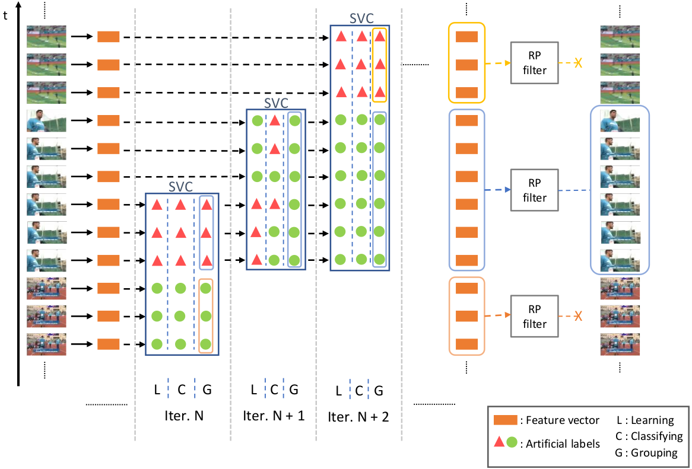

# SVC for Unsupervised Temporal Action Proposals

SVC-UAP model for unsupervised Temporal Action Proposals, which was presented [here](https://www.mdpi.com/1424-8220/20/10/2953/htm).

This project contains the code of the SVC-UAP model.  We provide the best parameter configuration for ActivityNet1.3 and Thumos14 datasets, though you can try your own configuration.

<p align="center">
  
</p>

### Content

  * [Citation](#citation)
  * [Preparing the data](#preparing-the-data)
    * [ActivityNet1.3](#activitynet13)
    * [Thumos'14](#thumos14)
  * [Usage](#usage)
    * [*Recommended: Prepare your Python environment*](#recommended-prepare-your-python-environment)
    * [Exeution options](#execution-options)
    * [Reproducing our results](#reproducing-our-results)
  * [Results](#results)
  * [Contact](#contact)

### Citation

If you find anything of this repository useful for your projects, please consider citing this work:

```bibtex
@article{Baptista2020svc,
	author  = {M. {Baptista R\'ios} and R. J. {L\'opez-Sastre} and F. J. {Acevedo-Rodr\'iguez} and P. {Mart\'in-Mart\'in} and S. {Maldonado-Basc\'on}},
	journal = {Sensors},
	title   = {Unsupervised Action Proposals Using Support Vector Classifiers for Online Video Processing},
	year	= {2020},
	volume  = {20},
	doi     = {10.3390/s20102953},
}
```

### Preparing the data

Before you start, please be sure to prepare the data as described below.

######  ActivityNet1.3

- Ground Truth:

  The code accepts ground truth files with `.json` format following ActivityNet style.

  For ActivityNet1.3, its annotations can be downloaded from [here](http://activity-net.org/download.html). Once you have them, remember to put the `.json` file in the `gt/` directory. 

  Additionally,  we provide the following command to directly download and put them in the right directory. Run it from project directory.

```bash
wget -O gt/activity_net.v1-3.min.json http://ec2-52-25-205-214.us-west-2.compute.amazonaws.com/files/activity_net.v1-3.min.json
```

- Features:

  For ActivityNet1.3, we have extracted C3D features pretrained on Sports1M dataset. Concretely, we used feature vectors from fc6 layer, with dimension 4096, corresponding each of them to a 16-frame volume. In each volume, 8 frames are overlapped. Afterwards, feature vectors are reduced to 500d with PCA.

  Features can be downloaded from `?`.

  Once you have them, store them as: `h5/c3d-activitynet.hdf5` 

###### Thumos'14

- Ground Truth:

  For Thumos'14, we have converted its original annotations to the ActivityNet format in a `.json` file. We share itwith this repo at `gt/gt-thumos14.json`.

- Features:

  We have extracted features with a C3D pretrained on Sports1M dataset. Concretely, we used feature vectors from fc6 layer, with dimension 4096, corresponding each of them to a non-overlapped 16-frame volume.

  Features can be downloaded from `?`.

  Once you have them, store them as: `h5/c3d-thumos14.hdf5` 

### Usage

#### *Recommended: Prepare your Python environment*

*The code has been prepared to be run with Python 3.7. As a recommendation, we propose to use Conda to create a python environment with the same version and with all the needed packages.*

*To this end, we provide the file `environment.yml` with all the requirements to create the conda environment with the exact same configuration as we use for this project. Typing the command below from the project directory will build the environment.*

```bash
conda env create -f environment.yml
```

*As an alternative, in case you prefer to work with pip, we also provide the file `requirements.txt` with all the packages the are required.*

#### Execution options

Once you have prepared the data, change the current directory to `source/`. Running `main.py` will lunch the whole svc-uap. However, remember to configure the following options:

- `-d`: name of the dataset.
- `-gt`: path to the ground truth file.
- `-h5`: path to the features file.
- `-set`: dataset subset.
- `-init_n`: initial number of samples to take when starting the algorithm or a new proposal.
- `-n`: number of new samples to take when analysing the same proposal.
- `-th`: classification error rate.
- `-c`: C parameter of the Linear SVM.
- `-rpth`: rank pooling threshold.
- `-res`: `.json` file with results.
- `-eval`: to set only evaluation mode.
- `-log`: log file with execution information.
- `-fig`: figure with th AR-AN metric.

#### Reproducing our results

If you just run the following command:

```bash
python main.py
```

you will get the results for the best parameter configuration for ActivityNet dataset.

On the other hand, if you want to reproduce the results of the best configuration for the Thumos'14 dataset, you should do as follows:

```bash
python main.py -data Thumos14 -gt ../gt/gt-thumos14.json -h5 ../h5/c3d-thumos14.hdf5 -set Test -init_n 8 -n 8 -th 0.09 -c 0.019306 -rpth 0.1
```

### Results

The code is prepared to provide at the end of execution the performance of the SVC-UAP method in terms of the AR-AN metric (Average Recall - Average Number of proposals). To this end, the code creates the directory `res/` (in the project directory) and stores:

- `ar-an.png`: figure with the AR-AN metric.
- `svc-uap-res.json`: result file with proposals.

In case you wish to evaluate again the results, you can lunch again the project but setting the `-eval` option to True. The code will just take the previously obtained `.json` result file with the proposals and evaluate it.

The code to evaluate Temporal Action Proposals is taken from the official ActivityNet evaluation repository: https://github.com/activitynet/ActivityNet

### Contact

For any question, you can open an issue or contact:

- Marcos Baptista Ríos: marcos.baptista@uah.es
